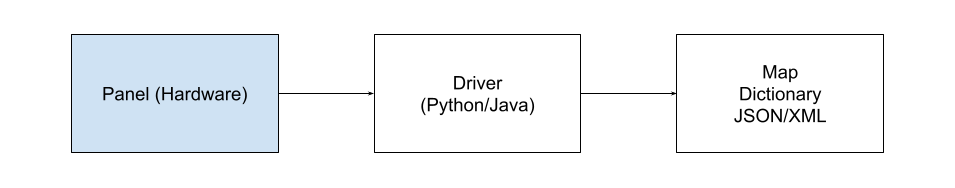

# WoC POC driver

## Overview

This driver allows backend application access event or control the entire process using ModBus TCP/IP or RS-485 protocol

<p align="center">
  
</p>

TODO Describe control panel

## Usage

### **Java**

**Instalation**

```xml
    <dependency>
        <groupId>org.controlpaneldriver</groupId>
        <artifactId>ControlPanelDriver</artifactId>
        <version>1.0-SNAPSHOT</version>
    </dependency>
```

See tests (TODO add tests)

TODO. Implement implementation usage

### **Notice**

```sh
- You need to be connected to control panel to access or send commands using IntelliJ
```

### **Python**

Just insert in your code

```python
from panel import Panel

...

# INITIALIZATION
ipAddress = "<YOUR PLC PANEL IP ADDRESS>" #IP ADDRESS
port = 502 #Port (Optional: Default 502)

controlPanel = Panel(ipAddress, port)
forceUpdate = True # Store value if ONLY changed

...

# READ EVENTS
controlPanel.plc.readSensors(forceUpdate) # Read from PLC

print(controlPanel.plc.getSensorsStr(not forceUpdate)) # Prints parsed sensors values in PLC register to dictionary

# Read events from energy meter
controlPanel.powerMeter.readSensors(forceUpdate) # Read from power meter

print(controlPanel.powerMeter.getSensorsStr(not forceUpdate)) # Prints parsed sensors values in power meter to dictionary

# SEND COMMANDS

controlPanel.plc.setResetSystem() # Reset system
controlPanel.plc.setSystemReady() # Set system ready (Start monitoring)
controlPanel.plc.setPumpON() # Set water pump ON
controlPanel.plc.toggleAutomaticMode() # Toggle Normal/Automatic mode
```


## Further readings

PLC4X - See [Options to communicating with PLCs](https://plc4x.apache.org/users/industry40.html)
